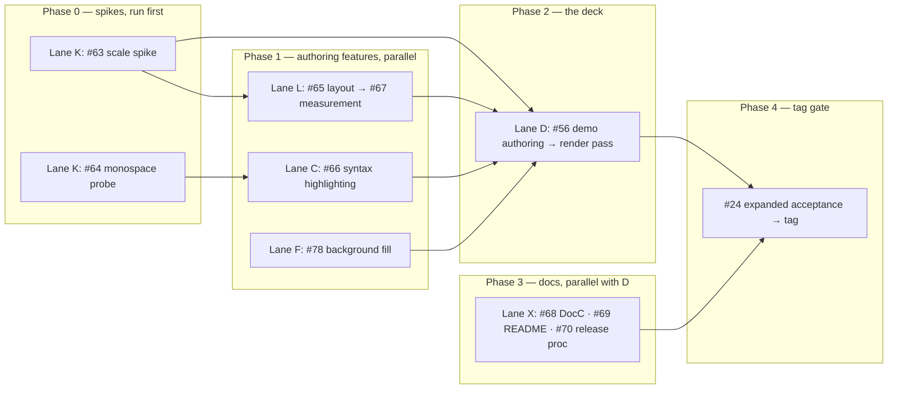

# Parallel worktrees for v0.1.0

How to run the remaining **v0.1.0 demo lane** across **git worktrees** without
stepping on each other. Integration branch: **`v0.1.x`**. Milestone
`gh issue list --milestone v0.1.0` is the authoritative remaining-work list;
map issue [#12](https://github.com/brightdigit/KeynoteKit/issues/12) tracks the
original package tickets.

The original #13–#24 package tickets are **complete** — their lanes and phasing
are archived at the bottom of this file for history.

This repo lives as a worktree of the bare clone `../KeynoteKit.git`. Add sibling
worktrees at the repo root, not nested inside another worktree.

## Principles

1. **One worktree ↔ one parallel lane** (not one ticket). A lane is a chain that
   can move without waiting on another lane's *code*.
2. **Merge into `v0.1.x` when a ticket's gate is green** — don't stack
   long-lived lane branches past their join points.
3. **Rebase from integration before starting the next ticket** in that lane so
   product seams stay aligned.
4. **Spikes gate the fan-out.** #63 (scale) and #64 (monospace) are cheap and
   de-risk everything downstream — run both before committing to the demo's
   slide count or its code-slide premise.
5. **Prefer fine-grained products** — lanes should mostly touch different
   targets; if two lanes must edit the same file, serialize or land one first.
6. **Only one Keynote-bound lane at a time** on a given Mac — render passes take
   over the app.

## Lanes (v0.1.0 demo)



| Lane | Tickets (in order) | Primary files / targets | Needs Keynote? |
|---|---|---|---|
| **K — Spikes** | #63, #64 | throwaway probes; findings only | **Yes** (both) |
| **L — Layout** | #65 → #67 | new `LayoutNode` + resolve pass in `KeynoteKit`; compile-time only | No (#67 verify: yes) |
| **C — Code color** | #66 | **new** `KeynoteKitSyntax` target + `swift-syntax` dep | No |
| **F — Fill** | #78 | `KeynoteArchiveSurgeon+ShapeStyle.swift`, `TextBox` | **Yes** (render pass) |
| **D — Demo** | #56 → render pass → manual movie | `KeynoteKitDemo` + `KeynoteKitDemoTool` products (scaffold landed; authoring remains) | **Yes** (2 cycles) |
| **X — Docs** | #68, #69, #70 | `.docc`, `README.md`, `docs/` | No |
| **T — Tag gate** | #24 | acceptance checklist | **Yes** |

**Why C and F are separate lanes.** Both feed the code slides, but #66 adds a
new target and touches no core files, while #78 edits the surgeon's shape-style
fork and `TextBox`. Zero file overlap, so they run concurrently and join before
#56.

**Why L chains.** #67 is an explicit follow-up to #65 (it needs the resolve
pass), and #67 is timeboxed with a documented fallback — if it fails, ship #65
alone and the demo uses explicit sizes.

**#52 does not gate anything.** It is the riskiest open item; if the probe
fails, author the demo at master body width and document the limitation.

## Suggested worktree layout

From the KeynoteKit repo root:

```text
KeynoteKit/
  KeynoteKit.git          # bare — never modify directly
  wt-spikes/              # lane K — #63, #64
  wt-layout/              # lane L — #65 → #67
  wt-syntax/              # lane C — #66
  wt-fill/                # lane F — #78
  wt-demo/                # lane D — #56 (Keynote machine)
  wt-docs/                # lane X — #68, #69, #70
```

### Create / remove

Run these from the repo root (the directory holding `KeynoteKit.git`). Use raw
`git worktree add`, **not** `git trees add` — the latter derives the directory
name from the branch and pushes immediately, creating a remote branch before
there is a commit. `--no-track` keeps the lane branch from inheriting `v0.1.x`'s
upstream and silently pushing to integration.

```bash
git fetch origin

# Phase 0 — spikes first (both Keynote-bound; run serially on one Mac):
git worktree add --no-track -b 63-scale-spike ../wt-spikes origin/v0.1.x

# Phase 1 — authoring features, all three in parallel:
git worktree add --no-track -b 65-layout-primitives ../wt-layout origin/v0.1.x
git worktree add --no-track -b 66-syntax-highlight  ../wt-syntax origin/v0.1.x
git worktree add --no-track -b 78-background-fill   ../wt-fill   origin/v0.1.x

# Docs lane — start any time, no code dependency:
git worktree add --no-track -b 68-docc-catalog ../wt-docs origin/v0.1.x

# Phase 2 — after #65/#66/#78 land on v0.1.x:
git worktree add --no-track -b 56-demo-deck ../wt-demo origin/v0.1.x
```

Branch naming: standard GitHub issue branching — `<issue>-<slug>`, no slashes
(e.g. `13-package-skeleton`). For a lane that chains several tickets, name it
after the first issue in the chain (e.g. `17-iwa-framing` for #17→#18).

Remove when done:

```bash
git worktree remove ../wt-layout
git branch -d 65-layout-primitives   # after merge
```

Each new worktree that runs Python research tools needs its own venv setup
(`mise trust`, `ensurepip`, `keynote-parser` install) — see PLAN Toolchain.

## Phasing (what runs in parallel when)

> **Current position (2026-08-02):** v0.1.0 scoped around the demo deliverable.
> #51 text layout shipped in `e658a69` (render pass still queued). Remaining
> milestone work: #63, #64, #65, #66, #67, #78, #56, #68, #69, #70, plus #24
> tag gate, #52 (non-blocking) and #12 map. #57 movie export demoted to v0.1.1;
> the v0.1.0 movie is recorded by hand.

### Phase 0 — spikes (do these first)

Lane K only. #63 validates the surgeon at 15–20 slides; #64 confirms a
monospace family renders. Both are Keynote-bound, so run them serially on one
Mac. Their outcomes can resize the whole demo — do not start Phase 1 features
speculatively if #63 shows a scale problem.

### Phase 1 — authoring features (three lanes in parallel)

Lanes L (#65→#67), C (#66), F (#78) run concurrently — different targets, no
file overlap. Lane X (docs) can start any time. Land each into `v0.1.x` as its
gate goes green.

### Phase 2 — the deck

Lane D (#56): products `KeynoteKitDemo` (library) + `KeynoteKitDemoTool`
(executable) are scaffolded with a three-slide stub (`DemoDeck`). Full
15–20 slide authoring + render pass still starts once #65, #66, and #78 are on
`v0.1.x`. Budget **two** human render cycles. Movie + screenshots are captured
manually here.

### Phase 3 — tag

#24 expanded acceptance pass, then tag `v0.1.0`.

## Archived — original #13–#24 package lanes (complete)

<details>
<summary>Historical lane map, phasing, and merge order for the completed package tickets</summary>

## Phasing (what runs in parallel when)

> **Current position (2026-08-01): #51 text layout implemented on branch `text-layout-51` (six gated commits — plain-by-default, TextListStyle, rotation, Paragraph/alignment/indent, verticalAlignment+columns, `text_layout` acceptance deck; angle + column-gap units pinned empirically, automated render check green). PR open against `v0.1-demo`; follow-up #52 filed (placeholder layout width). Next gate: human Keynote render pass over `swift run AcceptanceDecks` (11 decks).**
>
> - **Batch C complete:** PNG IHDR sizing (`PNGSize`) + `JPEGSize` SOF `length >= 7` / 0xFF-fill guards; `TextBox` stale "only drawable" doc fixed; `DSLAndLoweringTests` covers M9/M11/action-accumulate/magicId/curves/PNG/JPEG (declaration order ≠ z-order); `BuildRecord.description` for parity diffs; full `swift test` green; `LINT_MODE=STRICT ./Scripts/lint.sh` green. Still optional before tag: regenerate `swift run AcceptanceDecks` + AppleScript slide-image render check for M11/curves/magicId; consider a curved-path acceptance deck.
> - **Batch E complete:** tag refs get full CI matrix; `.swiftlint.yml` dropped duplicate `pattern_matching_keywords`; `lint.sh` ScriptingBridge guard extended + `$PACKAGE_DIR` quoting; PLAN products table notes `KeynoteKitScripting` shipped via #35; follow-up issues filed: #44 perf, #45 scripting robustness, #46 input hardening, #47 CI hygiene (SHA pins / cache pagination — permissions + fork guard already in tree), #48 DSL direction/RNG, #49 surgeon transactional staging (M4), #50 research moveInNonDefault + twist fixture. Rejected with rationale: empty-deck `write` bypass (template verified by acceptance suite); intentional scope creep on scripting/drawable depth (PLAN sync covers staleness); CodeRabbit draft noise.
>
> - Review batch D **landed**: M12 refuted with schema evidence (15.3 proto puts `custom_twist` on `TransitionAttributesArchive` only; no `AnimationAttributesArchive` shadow copies — a build block can never carry it; `BuildRecord` doc corrected). M13 `SlideOrder` order-sensitive synthetic tests + `nestedSlideNode` throw. M14 corpus SHA-256 (independent python-snappy digests). Known-answer vectors (SHA-1 `abc`, CRC-32 check value, copy1 offset > 255), trigger/delay/motion-path/autoAdvance lowering vectors, run-level italic/font, SlideBuilder control flow, `KeyBundle.upsertEntry` branches, `ArchiveGraphComparer` now compares `dataReferences`, empty-deck parse test.
> - Review batch B **landed**: M6 `TSPArchiveStream` UInt64-space bounds + `ProtobufVarint` overflow→nil; M7 Snappy clamped `reserveCapacity` (≤22× input), arm64_32-safe `maximumBlockSize`/varint/`readInteger`, per-element `expectedCount` fail-fast; M8 zip writer cumulative-offset guards → `.zip64Unsupported`, `Int(exactly:)` on untrusted reader fields; `IWAChunkCodec.maximumUncompressedChunkCount` now `let`. The documented "malformed input never traps" claims are now true, including 32-bit.
> - Review batch A **landed**: C1 per-slide data-id threading, M1 `ownedDrawables` remap, M2 clone-path uuid registration (+ verifier rule 6: minted slide-member records must be registered, exempting `KN.BuildChunkArchive`/`TSWP.NumberAttachmentArchive`), M3 throwing registration helpers (`missingComponent`), M5 one-slide-per-member assert, M4 invalidation doc, `hasTableAttachment` guard, id-0 fallbacks → throw, paragraph-fork header edge.
>
> - PR #39 (`211b956`) **merged** to `v0.1.x`: drawable depth (#3 geometry, #37 text formatting, #38 images) — issues closed; #5 closed (stay vendored); #12 map updated. Lane branch `3-37-38-drawable-depth` deleted local+remote; stale `24-build-acceptance-note` / `zip-storage-finding` deleted (squash-contained in `24f7c40` / `dda22d4`).
> - PR #41 (`45b8c4f`) **merged** to `v0.1.x` pre-tag: #40 mixed formatting runs (per-run `tableCharStyle` + minted `TSWP_CharacterStyleArchive` type 2021, render-verified by human pass) **plus the DSL rename** `Text`→`TextBox` / `TextRun`→`Text` — merged before the tag because it renames the public v0.1.0 surface. Lane branch `40-mixed-formatting-runs` deleted on remote; `wt-40-runs` can be removed. Catalog is now **9** decks (adds `text_runs`).
> - Keynote 15.3: all 8 pre-#40 acceptance decks were open+render green pre-merge on the identical tree (2026-07-31, scripted slide-image export + AppleScript probes — `drawable_open_crash.md`); `text_runs.key` render-verified by human pass the same day.
> - **Remaining before tag `v0.1.0`** (lane `24-expanded-acceptance`): human pass per the expanded checklist in `research/findings/acceptance_keynote_open.md` — confirm no silent "repair" dialog, animations play (Magic Move 1→2, image Dissolve In), builds/order/direction; optionally `KEYNOTEKIT_LIVE_KEYNOTE=1 swift test` to close #10. Then PR the recorded results, tag `v0.1.0`, close #24 + #12 (+ #40 housekeeping — its code merged via PR #41).
> - Post-v0.1.0 lanes otherwise unchanged: **#4** shapes deferred; **#10** live Keynote verify open. Cross-check with `gh issue view 12`.

### ~~Phase 0 — before #13 lands~~ (complete)

| Worktree | Ticket | Notes |
|---|---|---|
| `wt-scaffold` | #13 | Owns `Package.swift` / product graph |
| `wt-survey` | #15 | Docs-only; merge anytime; unblocks #16’s *decision* |
| `wt-goldens` | #19 | **Exclusive Keynote use** while regenerating |

### ~~Phase 1 — after #13~~ (complete)

| Worktree | Ticket | Touches |
|---|---|---|
| `wt-protobuf` | #14 | `KeynoteKitProtobuf` only |
| `wt-snappy` | #16 | `Snappy` only (needs #15’s decision merged) |
| `wt-template` | #21 | Resource + thin `basedOn:` wiring on `KeynoteKit` |

In practice #16 was chained in-lane after #15 in `wt-survey` rather than run in
its own `wt-snappy`, since #15 is docs-only and its decision was "vendor" (no
`Package.swift` edit, so no conflict with #14). #21 ran after #19 finished with
Keynote, not alongside it.

Conflict risk: #21 vs later authoring on `KeynoteKit` — keep #21 minimal (resource
+ default path only). Leave DSL to lane W.

### ~~Phase 2 — after #14 and #16~~ (complete)

| Worktree | Tickets | Touches |
|---|---|---|
| `wt-iwa` | #17 → #18 | `IWAFraming` + tests; may read protobuf + Snappy as deps |

Serialize #17 then #18 on the **same** branch/worktree — #18 is not parallelizable
with #17.

### ~~Phase 3 — after #18, #19, and #21~~ (complete through #23)

| Worktree | Tickets | Touches |
|---|---|---|
| `wt-authoring` | #20 → #22 → #23 → #24 | `KeynoteKit` write path + API |

Single lane: each ticket needs the previous gate. #24 is human + Keynote;
don’t overlap with #19’s Keynote sessions.


</details>

## Merge order at join points

Land in this order when multiple PRs are ready:

1. **#63** and **#64** before committing to demo scope (spikes inform it)
2. **#65** before **#67** (measurement needs the resolve pass)
3. **#65**, **#66**, **#78** before **#56** (any order among the three)
4. **#56** before the manual movie capture and **#58**
5. **#24** last — the tag gate

Prefer small PRs into `v0.1.x`, not lane-to-lane merges.

## Agent / human split

| Kind | Good for agents in parallel worktrees | Prefer human / HITL |
|---|---|---|
| AFK | #65, #66, #67, #68, #69, #70, and #78's implementation | — |
| Keynote-bound | — | #63 scale, #64 monospace, #78's render check, #56 render pass, #24 acceptance |

#78 splits: an agent writes the fill into the shape fork and its structural
test AFK, then a human confirms Keynote draws it behind the text.

Run at most **one** Keynote-bound lane at a time on a given Mac.

## Conflict hotspots

| Area | Who touches it | Rule |
|---|---|---|
| `Package.swift` | #66 (done), #56 demo products (scaffold landed) | `KeynoteKitDemo` + `KeynoteKitDemoTool` products exist; further #56 work is deck content |
| `KeynoteArchiveSurgeon+ShapeStyle.swift` | #78 only | Sole owner — no other demo lane edits the shape fork |
| `TextBox.swift` | #78 (fill), #65 (padding modifiers) | Both add modifiers; land #78 first or rebase L on it |
| `Sources/KeynoteKitDemo/` | #56 authoring | One new file per slide in `Slides/`, listed in `DemoDeck.swift` |
| `Sources/AcceptanceDeckCatalog/` | #78 verification decks | Additive files only — never rewrite an existing deck |
| `.claude/PLAN.md` / handoff | any lane recording a decision | Tiny additive edits; rebase carefully |
| GitHub issues + milestones | claim / close / re-milestone | Source of truth; `gh issue list --milestone v0.1.0` |

## Checklist per lane session

1. Create/update worktree from current `v0.1.x`.
2. Claim the ticket (`gh issue edit <n> --add-assignee @me`).
3. Implement until the ticket's acceptance checklist is green.
4. `swift test` + `LINT_MODE=STRICT ./Scripts/lint.sh` before opening the PR.
5. Open PR → merge to `v0.1.x`.
6. Delete lane branch / remove worktree (or reset for the next ticket in-lane).
7. Close the GitHub issue.

## What not to do

- Don't put two lanes in one worktree with uncommitted cross-product edits.
- Don't start #56 against unmerged #65/#66/#78 branches — integrate first.
- Don't run two Keynote-bound lanes at once on one Mac.
- Don't let #52 block the tag — fall back to master body width and document it.
- Don't implement #57 movie export automation in the demo lane; it is v0.1.1.
