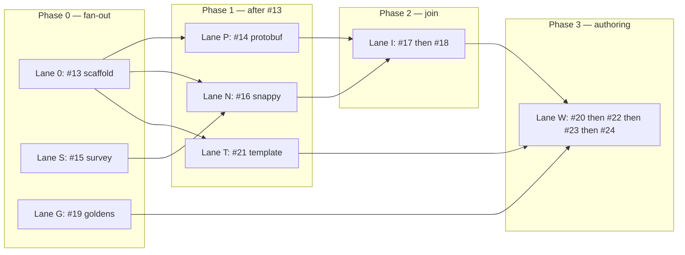

# Parallel worktrees for v0.1.0 tickets

How to run the [12 tickets](https://github.com/brightdigit/KeynoteKit/issues/12)
(#13–#24) across **git worktrees** without stepping on each other. Integration
branch: **`v0.1.x`**. (The old `feature/swift-package` branch was squashed into
`v0.1.x` and no longer exists — if you find it referenced anywhere, read it as
`v0.1.x`.)

This repo lives as a worktree of the bare clone `../KeynoteKit.git`. Add sibling
worktrees at the repo root, not nested inside another worktree.

## Principles

1. **One worktree ↔ one parallel lane** (not one ticket). A lane is a chain that
   can move without waiting on another lane’s *code*.
2. **Merge into `v0.1.x` when a ticket’s gate is green** — don’t
   stack long-lived lane branches past their join points.
3. **Rebase or merge from integration before starting the next ticket** in that
   lane so product seams (`Snappy`, `IWAFraming`, …) stay aligned.
4. **#13 is the fan-out gate.** Until it lands on integration, only lanes
   that don’t need `Package.swift` (#15 survey, #19 goldens) should run in
   parallel with it.
5. **Prefer fine-grained products** — lanes should mostly touch different
   products; if two lanes must edit the same target, serialize or land one first.

## Lanes



| Lane | Tickets (in order) | Primary products / artifacts | Needs Keynote? |
|---|---|---|---|
| **0 — Scaffold** | #13 | `Package.swift`, all five product stubs, CI/lint | No |
| **S — Survey** | #15 | PLAN decision log only (docs) | No |
| **G — Goldens** | #19 | Committed `.key` goldens / samples policy | **Yes** (takes over the app) |
| **P — Protobuf** | #14 | `KeynoteKitProtobuf` | No |
| **N — Snappy** | #16 *(after #13+#15)* | `Snappy` | No |
| **T — Template** | #21 *(after #13)* | Bundled `.key` resource on `KeynoteKit` | Hand-author in Keynote once |
| **I — IWA** | #17 → #18 *(after #14+#16)* | `IWAFraming`, navigation/tests | No |
| **W — Writer+API** | #20 → #22 → #23 → #24 *(after #18+#19+#21)* | `KeynoteKit` | #24 yes (human open) |

`KeynoteKitScripting` stays empty until GitHub #10 — no lane.

## Suggested worktree layout

From the KeynoteKit repo root:

```text
KeynoteKit/
  KeynoteKit.git          # bare — never modify directly
  wt-scaffold/            # lane 0 — #13
  wt-survey/              # lane S — #15
  wt-goldens/             # lane G — #19 (Keynote machine)
  wt-protobuf/            # lane P — #14
  wt-snappy/              # lane N — #16
  wt-template/            # lane T — #21
  wt-iwa/                 # lane I — #17–#18
  wt-authoring/           # lane W — #20–#24
```

You do **not** need every worktree at once. Create a worktree when that lane
starts; remove it when the lane’s tickets are merged.

### Create / remove

Run these from the repo root (the directory holding `KeynoteKit.git`). Use raw
`git worktree add`, **not** `git trees add` — the latter derives the directory
name from the branch and pushes immediately, creating a remote branch before
there is a commit. `--no-track` keeps the lane branch from inheriting `v0.1.x`'s
upstream and silently pushing to integration.

```bash
git fetch origin

git worktree add --no-track -b 13-package-skeleton ../wt-scaffold origin/v0.1.x
git worktree add --no-track -b 15-snappy-survey    ../wt-survey   origin/v0.1.x
git worktree add --no-track -b 19-goldens          ../wt-goldens  origin/v0.1.x

# After #13 is on v0.1.x:
git worktree add --no-track -b 14-protobuf ../wt-protobuf origin/v0.1.x
git worktree add --no-track -b 16-snappy   ../wt-snappy   origin/v0.1.x
git worktree add --no-track -b 21-template ../wt-template origin/v0.1.x

# After #14+#16 merged:
git worktree add --no-track -b 17-iwa-framing ../wt-iwa origin/v0.1.x

# After #18+#19+#21 merged:
git worktree add --no-track -b 20-writer ../wt-authoring origin/v0.1.x
```

Branch naming: standard GitHub issue branching — `<issue>-<slug>`, no slashes
(e.g. `13-package-skeleton`). For a lane that chains several tickets, name it
after the first issue in the chain (e.g. `17-iwa-framing` for #17→#18).

Remove when done:

```bash
git worktree remove ../wt-scaffold
git branch -d 13-package-skeleton   # after merge
```

Each new worktree that runs Python research tools needs its own venv setup
(`mise trust`, `ensurepip`, `keynote-parser` install) — see PLAN Toolchain.

## Phasing (what runs in parallel when)

> **Current position (2026-07-31, post-#41): PR #43 author-review fix batches landing as direct commits on `v0.1.x` (A surgeon/cloner → B trap hardening → D test infra → C DSL/lowering → E CI/docs/issues; plan: `~/.claude/plans/let-s-create-a-plan-fancy-stearns.md`), then the expanded #24 human pass.**
>
> - Review batch B **landed**: M6 `TSPArchiveStream` UInt64-space bounds + `ProtobufVarint` overflow→nil; M7 Snappy clamped `reserveCapacity` (≤22× input), arm64_32-safe `maximumBlockSize`/varint/`readInteger`, per-element `expectedCount` fail-fast; M8 zip writer cumulative-offset guards → `.zip64Unsupported`, `Int(exactly:)` on untrusted reader fields; `IWAChunkCodec.maximumUncompressedChunkCount` now `let`. The documented "malformed input never traps" claims are now true, including 32-bit.
> - Review batch A **landed**: C1 per-slide data-id threading, M1 `ownedDrawables` remap, M2 clone-path uuid registration (+ verifier rule 6: minted slide-member records must be registered, exempting `KN.BuildChunkArchive`/`TSWP.NumberAttachmentArchive`), M3 throwing registration helpers (`missingComponent`), M5 one-slide-per-member assert, M4 invalidation doc, `hasTableAttachment` guard, id-0 fallbacks → throw, paragraph-fork header edge.
>
> - PR #39 (`211b956`) **merged** to `v0.1.x`: drawable depth (#3 geometry, #37 text formatting, #38 images) — issues closed; #5 closed (stay vendored); #12 map updated. Lane branch `3-37-38-drawable-depth` deleted local+remote; stale `24-build-acceptance-note` / `zip-storage-finding` deleted (squash-contained in `24f7c40` / `dda22d4`).
> - PR #41 (`45b8c4f`) **merged** to `v0.1.x` pre-tag: #40 mixed formatting runs (per-run `tableCharStyle` + minted `TSWP_CharacterStyleArchive` type 2021, render-verified by human pass) **plus the DSL rename** `Text`→`TextBox` / `TextRun`→`Text` — merged before the tag because it renames the public v0.1.0 surface. Lane branch `40-mixed-formatting-runs` deleted on remote; `wt-40-runs` can be removed. Catalog is now **9** decks (adds `text_runs`).
> - Keynote 15.3: all 8 pre-#40 acceptance decks were open+render green pre-merge on the identical tree (2026-07-31, scripted slide-image export + AppleScript probes — `drawable_open_crash.md`); `text_runs.key` render-verified by human pass the same day.
> - **Remaining before tag `v0.1.0`** (lane `24-expanded-acceptance`): human pass per the expanded checklist in `research/findings/acceptance_keynote_open.md` — confirm no silent "repair" dialog, animations play (Magic Move 1→2, image Dissolve In), builds/order/direction; optionally `KEYNOTEKIT_LIVE_KEYNOTE=1 swift test` to close #10. Then PR the recorded results, tag `v0.1.0`, close #24 + #12 (+ #40 housekeeping — its code merged via PR #41).
> - Post-v0.1.0 lanes otherwise unchanged: **#4** shapes deferred; **#10** live Keynote verify open. Cross-check with `gh issue view 12`.

### ~~Phase 0 — before #13 lands~~ (complete)

| Worktree | Ticket | Notes |
|---|---|---|
| `wt-scaffold` | #13 | Owns `Package.swift` / product graph |
| `wt-survey` | #15 | Docs-only; merge anytime; unblocks #16’s *decision* |
| `wt-goldens` | #19 | **Exclusive Keynote use** while regenerating |

### ~~Phase 1 — after #13~~ (complete)

| Worktree | Ticket | Touches |
|---|---|---|
| `wt-protobuf` | #14 | `KeynoteKitProtobuf` only |
| `wt-snappy` | #16 | `Snappy` only (needs #15’s decision merged) |
| `wt-template` | #21 | Resource + thin `basedOn:` wiring on `KeynoteKit` |

In practice #16 was chained in-lane after #15 in `wt-survey` rather than run in
its own `wt-snappy`, since #15 is docs-only and its decision was "vendor" (no
`Package.swift` edit, so no conflict with #14). #21 ran after #19 finished with
Keynote, not alongside it.

Conflict risk: #21 vs later authoring on `KeynoteKit` — keep #21 minimal (resource
+ default path only). Leave DSL to lane W.

### ~~Phase 2 — after #14 and #16~~ (complete)

| Worktree | Tickets | Touches |
|---|---|---|
| `wt-iwa` | #17 → #18 | `IWAFraming` + tests; may read protobuf + Snappy as deps |

Serialize #17 then #18 on the **same** branch/worktree — #18 is not parallelizable
with #17.

### ~~Phase 3 — after #18, #19, and #21~~ (complete through #23)

| Worktree | Tickets | Touches |
|---|---|---|
| `wt-authoring` | #20 → #22 → #23 → #24 | `KeynoteKit` write path + API |

Single lane: each ticket needs the previous gate. #24 is human + Keynote;
don’t overlap with #19’s Keynote sessions.

## Merge order at join points

Land in this order when multiple PRs are ready:

1. **#13** before anything that edits package layout
2. **#15** before **#16** (decision must be on the branch #16 builds from)
3. **#14** and **#16** before **#17** (either order vs each other)
4. **#17** before **#18**
5. **#18**, **#19**, **#21** before **#20** (any order among those three)
6. **#20** → **#22** → **#23** → **#24**

Prefer small PRs into `v0.1.x`, not lane-to-lane merges.

## Agent / human split

| Kind | Good for agents in parallel worktrees | Prefer human / HITL |
|---|---|---|
| AFK | #13, #14, #15, #16, #17, #18, #20, #22, #23 | — |
| Keynote-bound | — | #19 (regen), #21 (author blank template), #24 (open five decks) |

Run at most **one** Keynote-bound lane at a time on a given Mac.

## Conflict hotspots

| Area | Who touches it | Rule |
|---|---|---|
| `Package.swift` | #13 primarily; later tickets add deps sparingly | After #13, only add a dependency in the ticket that owns that product |
| `KeynoteKit` | #21 (thin), then #20–#24 | Finish #21 before #20 starts if both touch write entry |
| `.claude/PLAN.md` decision log | #15, #22 | Tiny additive edits; rebase carefully |
| GitHub issues (#13–#24) | Claim / close / unlock dependents | Source of truth; see map #12 |
| Goldens / samples | #19 | Don’t let #20 rewrite goldens — only consume them |

## Checklist per lane session

1. Create/update worktree from current `v0.1.x`.
2. Claim the ticket (`gh issue edit <n> --add-assignee @me`).
3. Implement until the ticket’s acceptance checklist is green.
4. Open PR → merge to `v0.1.x`.
5. Delete lane branch / remove worktree (or reset branch for the next ticket in-lane).
6. Close the GitHub issue; dependents unblock via native `blocked_by` edges.

## What not to do

- Don’t put two lanes in one worktree with uncommitted cross-product edits.
- Don’t start #17 “early” against unmerged #14/#16 branches — integrate first.
- Don’t run #19 and #24 (or #21’s Keynote authoring) at the same time on one app.
- Don’t implement `#10` ScriptingBridge in the authoring lane — separate product, later issue.
