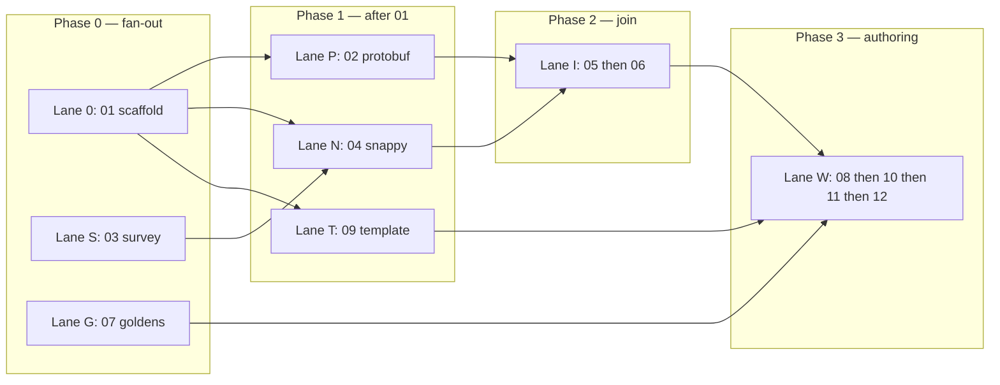

# Parallel worktrees for v0.1.0 tickets

How to run the [12 tickets](issues/README.md) across **git worktrees** without
stepping on each other. Integration branch: `feature/swift-package`.

This repo already lives as a worktree of the bare clone
`../KeynoteKit.git`. Add sibling worktrees next to `swift-package`, not nested
inside it.

## Principles

1. **One worktree ↔ one parallel lane** (not one ticket). A lane is a chain that
   can move without waiting on another lane’s *code*.
2. **Merge into `feature/swift-package` when a ticket’s gate is green** — don’t
   stack long-lived lane branches past their join points.
3. **Rebase or merge from integration before starting the next ticket** in that
   lane so product seams (`Snappy`, `IWAFraming`, …) stay aligned.
4. **Ticket 01 is the fan-out gate.** Until it lands on integration, only lanes
   that don’t need `Package.swift` (03 survey, 07 goldens) should run in
   parallel with it.
5. **Prefer fine-grained products** — lanes should mostly touch different
   products; if two lanes must edit the same target, serialize or land one first.

## Lanes



| Lane | Tickets (in order) | Primary products / artifacts | Needs Keynote? |
|---|---|---|---|
| **0 — Scaffold** | 01 | `Package.swift`, all five product stubs, CI/lint | No |
| **S — Survey** | 03 | PLAN decision log only (docs) | No |
| **G — Goldens** | 07 | Committed `.key` goldens / samples policy | **Yes** (takes over the app) |
| **P — Protobuf** | 02 | `KeynoteKitProtobuf` | No |
| **N — Snappy** | 04 *(after 01+03)* | `Snappy` | No |
| **T — Template** | 09 *(after 01)* | Bundled `.key` resource on `KeynoteKit` | Hand-author in Keynote once |
| **I — IWA** | 05 → 06 *(after 02+04)* | `IWAFraming`, navigation/tests | No |
| **W — Writer+API** | 08 → 10 → 11 → 12 *(after 06+07+09)* | `KeynoteKit` | 12 yes (human open) |

`KeynoteKitScripting` stays empty until GitHub #10 — no lane.

## Suggested worktree layout

From the KeynoteKit parent directory (sibling of `swift-package`):

```text
KeynoteKit/
  KeynoteKit.git          # bare
  swift-package/          # integration: feature/swift-package
  wt-scaffold/            # lane 0 — ticket 01
  wt-survey/              # lane S — ticket 03
  wt-goldens/             # lane G — ticket 07 (Keynote machine)
  wt-protobuf/            # lane P — ticket 02
  wt-snappy/              # lane N — ticket 04
  wt-template/            # lane T — ticket 09
  wt-iwa/                 # lane I — tickets 05–06
  wt-authoring/           # lane W — tickets 08–12
```

You do **not** need every worktree at once. Create a worktree when that lane
starts; remove it when the lane’s tickets are merged.

### Create / remove

```bash
# From swift-package (or any worktree of the bare repo)
git fetch origin
git worktree add -b v010/01-scaffold ../wt-scaffold feature/swift-package
git worktree add -b v010/03-survey  ../wt-survey  feature/swift-package
git worktree add -b v010/07-goldens ../wt-goldens feature/swift-package

# After 01 is on feature/swift-package:
git worktree add -b v010/02-protobuf ../wt-protobuf feature/swift-package
git worktree add -b v010/04-snappy   ../wt-snappy   feature/swift-package
git worktree add -b v010/09-template ../wt-template feature/swift-package

# After 02+04 merged:
git worktree add -b v010/05-iwa ../wt-iwa feature/swift-package

# After 06+07+09 merged:
git worktree add -b v010/08-authoring ../wt-authoring feature/swift-package
```

Branch naming: `v010/<ticket>-<slug>` for single-ticket lanes; keep one branch
per lane when the lane is a short chain (e.g. `v010/iwa` for 05→06).

Remove when done:

```bash
git worktree remove ../wt-scaffold
git branch -d v010/01-scaffold   # after merge
```

Each new worktree that runs Python research tools needs its own venv setup
(`mise trust`, `ensurepip`, `keynote-parser` install) — see PLAN Toolchain.

## Phasing (what runs in parallel when)

### Phase 0 — before 01 lands (max 3 worktrees)

| Worktree | Ticket | Notes |
|---|---|---|
| `wt-scaffold` | 01 | Owns `Package.swift` / product graph |
| `wt-survey` | 03 | Docs-only; merge anytime; unblocks 04’s *decision* |
| `wt-goldens` | 07 | **Exclusive Keynote use** while regenerating |

Do not start 02/04/09 until 01 is merged to `feature/swift-package`.

### Phase 1 — after 01 (max 3 code worktrees + goldens if still open)

| Worktree | Ticket | Touches |
|---|---|---|
| `wt-protobuf` | 02 | `KeynoteKitProtobuf` only |
| `wt-snappy` | 04 | `Snappy` only (needs 03’s decision merged) |
| `wt-template` | 09 | Resource + thin `basedOn:` wiring on `KeynoteKit` |

Conflict risk: 09 vs later authoring on `KeynoteKit` — keep 09 minimal (resource
+ default path only). Leave DSL to lane W.

### Phase 2 — after 02 and 04

| Worktree | Tickets | Touches |
|---|---|---|
| `wt-iwa` | 05 → 06 | `IWAFraming` + tests; may read protobuf + Snappy as deps |

Serialize 05 then 06 on the **same** branch/worktree — 06 is not parallelizable
with 05.

### Phase 3 — after 06, 07, and 09

| Worktree | Tickets | Touches |
|---|---|---|
| `wt-authoring` | 08 → 10 → 11 → 12 | `KeynoteKit` write path + API |

Single lane: each ticket needs the previous gate. Ticket 12 is human + Keynote;
don’t overlap with 07’s Keynote sessions.

## Merge order at join points

Land in this order when multiple PRs are ready:

1. **01** before anything that edits package layout  
2. **03** before **04** (decision must be on the branch 04 builds from)  
3. **02** and **04** before **05** (either order vs each other)  
4. **05** before **06**  
5. **06**, **07**, **09** before **08** (any order among those three)  
6. **08** → **10** → **11** → **12**

Prefer small PRs into `feature/swift-package`, not lane-to-lane merges.

## Agent / human split

| Kind | Good for agents in parallel worktrees | Prefer human / HITL |
|---|---|---|
| AFK | 01, 02, 03, 04, 05, 06, 08, 10, 11 | — |
| Keynote-bound | — | 07 (regen), 09 (author blank template), 12 (open five decks) |

Run at most **one** Keynote-bound lane at a time on a given Mac.

## Conflict hotspots

| Area | Who touches it | Rule |
|---|---|---|
| `Package.swift` | 01 primarily; later tickets add deps sparingly | After 01, only add a dependency in the ticket that owns that product |
| `KeynoteKit` | 09 (thin), then 08–12 | Finish 09 before 08 starts if both touch write entry |
| `PLAN.md` decision log | 03, 10 | Tiny additive edits; rebase carefully |
| `.scratch/.../issues` | Status updates only | Optional; don’t block merges on scratch edits |
| Goldens / samples | 07 | Don’t let 08 rewrite goldens — only consume them |

## Checklist per lane session

1. Create/update worktree from current `feature/swift-package`.
2. Claim the ticket (assignee if on GitHub; otherwise note in scratch Status).
3. Implement until the ticket’s acceptance checklist is green.
4. Open PR → merge to `feature/swift-package`.
5. Delete lane branch / remove worktree (or reset branch for the next ticket in-lane).
6. Mark the scratch issue done; unlock dependents.

## What not to do

- Don’t put two lanes in one worktree with uncommitted cross-product edits.
- Don’t start 05 “early” against unmerged 02/04 branches — integrate first.
- Don’t run 07 and 12 (or 09’s Keynote authoring) at the same time on one app.
- Don’t implement `#10` ScriptingBridge in the authoring lane — separate product, later issue.
