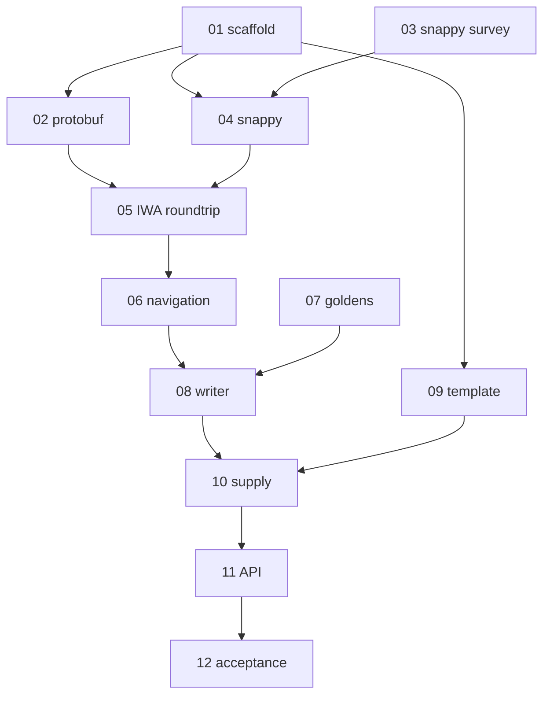

# v0.1.0 Swift package — ticket index

Local tracer-bullet tickets for [`PLAN.md`](../../../PLAN.md).
GitHub issue bodies are embedded in each file (section “GitHub issue body”).

**How to run them in parallel:** see [`../PARALLEL-WORKTREES.md`](../PARALLEL-WORKTREES.md)
(lanes, worktree layout, phasing, merge order).

## Frontier (unblocked now)

- [01 — Package skeleton + products + scaffolding](01-package-skeleton-and-scaffolding.md)
- [03 — Survey Snappy block-level packages](03-survey-snappy-block-packages.md)
- [07 — Regenerate & commit Python golden decks](07-regenerate-python-golden-decks.md)

## All tickets

| # | File | Blocked by |
|---|---|---|
| 01 | [package skeleton](01-package-skeleton-and-scaffolding.md) | — |
| 02 | [KeynoteKitProtobuf](02-vendor-schema-keynotekitprotobuf.md) | 01 |
| 03 | [Snappy survey](03-survey-snappy-block-packages.md) | — |
| 04 | [Snappy codec](04-snappy-block-codec.md) | 01, 03 |
| 05 | [IWA + zip round-trip](05-iwa-framing-key-roundtrip.md) | 02, 04 |
| 06 | [Archive navigation](06-archive-navigation-extract-builds.md) | 05 |
| 07 | [Python goldens](07-regenerate-python-golden-decks.md) | — |
| 08 | [Writer + invariants](08-writer-goldens-and-invariants.md) | 06, 07 |
| 09 | [Bundled template](09-minimal-bundled-template.md) | 01 |
| 10 | [Slide/text supply](10-slide-and-text-item-supply.md) | 08, 09 |
| 11 | [Authoring API](11-authoring-api-slidecontent.md) | 10 |
| 12 | [Acceptance](12-acceptance-keynote-15-3.md) | 11 |

Deferred (not in this set): [#10](https://github.com/brightdigit/KeynoteKit/issues/10) ScriptingBridge body (`KeynoteKitScripting` product only reserved in 01).
