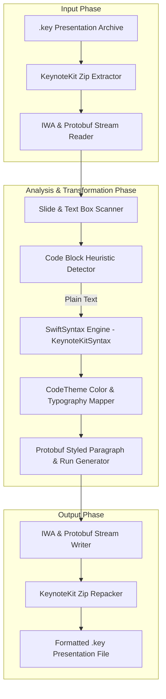

# Research Finding: Keynote Code Syntax Highlighting Product & Monetization Strategy

**Date:** August 2026  
**Status:** Approved Product & Technical Research Specification  
**Context:** Extends `KeynoteKitSyntax` (#66) into a commercial product offering.

---

## 1. Executive Summary & Value Proposition

Existing tools for adding code to Apple Keynote force presenters to rely on cumbersome manual workflows:
- **Xcode / VS Code copy-paste:** Copying rich text loses formatting predictability, line-wrapping consistency, and custom dark/light themes.
- **Carbon / CodeSnap PNG Screenshots:** Image-based code blocks cannot be searched, resized cleanly without bitmap pixelation, or animated using native Keynote transitions (e.g. Magic Move).
- **Online RTF converters:** Multi-step browser-to-clipboard workflows that break presentation flow.

**The Core Product Concept:** An **In-Place Keynote Presentation Code Formatter (`Keynote Code Formatter`)** powered by `KeynoteKit` and `KeynoteKitSyntax`. Presenters write or paste draft Swift code directly into Keynote text boxes. When ready, the application processes the `.key` presentation in-place, automatically detecting code blocks and applying syntax highlighting without any manual copy-and-paste.

---

## 2. In-Place `.key` Presentation Processing Engine

The application directly operates on native Keynote document packages (`.key` files) using `KeynoteKit`.



### Code Block Detection Heuristics

To reliably identify code text boxes within an existing Keynote deck without altering non-code text elements, the engine applies three detection rules:

1. **Rule 1: Monospaced Font Detection (Default Heuristic)**
   - Text boxes formatted in monospaced font families (`Menlo`, `Courier`, `Courier New`, `Monaco`, `SF Mono`, `JetBrains Mono`, `Fira Code`) are automatically treated as code blocks.
2. **Rule 2: Markdown Code Fences**
   - Text boxes starting with ` ```swift ` or ` ``` ` are processed as code blocks. The fence markers are stripped, and the inner code is styled.
3. **Rule 3: Object Title & Tag Labels**
   - Text boxes tagged `#code` or labeled with a `code` object name in Keynote's format inspector are styled.

---

## 3. Product Packaging & Form Factors

We propose a dual-packaging strategy targeting both non-technical presentation creators and developer power-users:

### Form Factor A: Standalone macOS SwiftUI App ("Keynote Code Formatter")
- **Drag & Drop Interface:** Users drop one or more `.key` files into a clean macOS window.
- **Theme & Typography Picker:** Visual preview of themes (`Midnight`, `Xcode Dark`, `Xcode Light`, `Dracula`, `Monokai`, `VS Code Dark+`) and font selections (`Menlo`, `SF Mono`, `JetBrains Mono`).
- **One-Click Format Button:** Processes the `.key` file and creates a formatted copy (`presentation-formatted.key`) or overwrites in-place with automatic backup creation.

### Form Factor B: Developer Command-Line Interface (`keynote-code`)
- **CLI Utility:** `keynote-code format deck.key --theme midnight --font Menlo`
- **Use Case:** Automated slide deck build pipelines (e.g. generating presentation decks from Markdown or Swift code repositories).

---

## 4. Flexible Monetization & Distribution Framework

We maintain an **Open-Core & Commercial Distribution Strategy**:

```mermaid
graph TD
    subgraph Open Source Core ["MIT Open-Source Engine"]
        KeynoteKit Core
        KeynoteKitSyntax
    end

    subgraph Commercial Products ["Commercial Monetization"]
        AppStore["Mac App Store (StoreKit 2 IAP / Subscription)"]
        DirectWeb["Direct Download (Sparkle 2 + Paddle / LemonSqueezy)"]
        CLILicense["Enterprise / Developer CLI Key"]
    end

    Open Source Core --> Commercial Products
```

### Tiered Pricing Structure

| Feature | Free Tier | Pro Tier ($29.99 Lifetime / $9.99/yr) | Enterprise / Team ($79/yr) |
| :--- | :---: | :---: | :---: |
| **In-Place `.key` File Formatting** | Up to 5 code slides per deck | Unlimited slides | Unlimited slides |
| **Swift Syntax Highlighting** | ✅ | ✅ | ✅ |
| **Standard Themes (Midnight)** | ✅ | ✅ | ✅ |
| **All Themes (20+ Preset Themes)** | ❌ | ✅ | ✅ |
| **Custom Theme Creator** | ❌ | ✅ | ✅ |
| **Batch Multi-File Processing** | ❌ | ✅ | ✅ |
| **Window Frame Borders (Traffic Lights)** | ❌ | ✅ | ✅ |
| **Developer CLI (`keynote-code`)** | ❌ | ❌ | ✅ |

### Distribution Channels
1. **Mac App Store (MAS):** Frictionless purchase flow using Apple StoreKit 2.
2. **Direct Web Download:** Notarized DMG signed with Apple Developer ID, using **Sparkle 2** for seamless auto-updates and **Paddle** or **LemonSqueezy** for license validation.

---

## 5. Verification & Testing Strategy

- **Protobuf Stream Validation:** Assert that modified `.iwa` archives maintain valid protobuf message tags (`TSPRegistryMapping`).
- **Round-Trip Integrity:** Assert that non-code slides, shapes, images, and master slide styles are preserved with 100% fidelity.
- **Keynote Rendering Verification:** Open transformed `.key` files in Apple Keynote 15.3+ to ensure zero corruption alerts and clean visual rendering.
