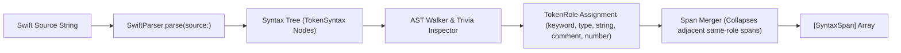
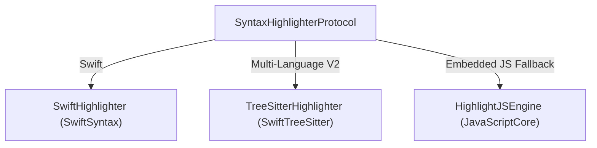

# Research Finding: Syntax Highlighter Architecture & Multi-Language Seam

**Date:** August 2026  
**Status:** Approved Architectural Specification  
**Context:** Defines the high-level syntax highlighting architecture for `KeynoteKitSyntax`.

---

## 1. Architectural Goals

1. **Swift-First Engine (V1):** Leverage `SwiftSyntax` for 100% accurate Swift code parsing, including keywords, types, comments, string interpolation, and literal values.
2. **Multi-Language Abstraction Seam (V2+):** Establish a clean protocol interface so multi-language highlighters (e.g. Tree-sitter, Highlight.js, Chroma) can be plugged in seamlessly without breaking API compatibility.
3. **Exact Character Preservation Guarantee:** Highlighting must never alter, drop, or substitute source characters — every span concatenation must equal the original input verbatim.

---

## 2. Syntax Highlighter Protocol Interface

```swift
public enum SupportedLanguage: String, Sendable, CaseIterable {
  case swift
  case typescript
  case python
  case rust
  case go
  case sql
  case json
}

/// Abstract protocol for syntax highlighting engines.
public protocol SyntaxHighlighterProtocol: Sendable {
  /// The programming language supported by this highlighter instance.
  var language: SupportedLanguage { get }

  /// Splitting source code into role-tagged spans.
  func spans(of source: String) -> [SyntaxSpan]
}

/// Contiguous run of source code sharing a role.
public struct SyntaxSpan: Equatable, Sendable {
  public var text: String
  public var role: TokenRole

  public init(text: String, role: TokenRole) {
    self.text = text
    self.role = role
  }
}
```

---

## 3. Swift Engine Implementation (`SwiftSyntax`)

The V1 implementation wraps `SwiftSyntax`'s `SwiftParser` to perform context-aware AST walking:



### Context-Aware Role Resolution
- **Type Position Resolution:** An identifier token `Foo` is mapped to `.type` when its parent node conforms to `IdentifierTypeSyntax.self`. Otherwise, it is mapped to `.plain`.
- **Trivia Comment Resolution:** Line and block comments attached as leading/trailing trivia are mapped to `.comment`.

---

## 4. Multi-Language Expansion Seam (V2 Roadmap)

For V2 multi-language support (TypeScript, Python, Rust, Go), the architecture permits swapping the engine under `SyntaxHighlighterProtocol`:



This abstraction ensures that `CodeBlock`, `DeckCodeFormatter`, and the macOS App consume `SyntaxSpan` representations uniformly regardless of the underlying parsing technology.
